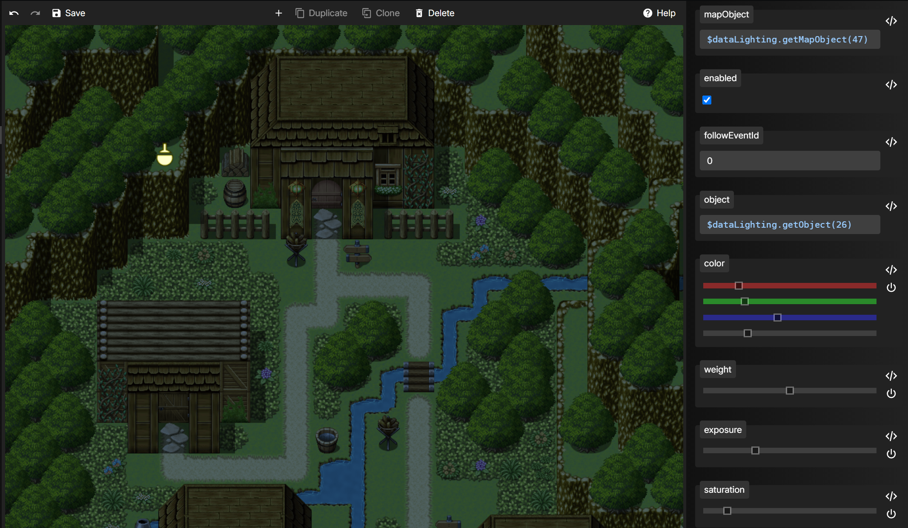

# Plugin Command Example

## Preparation
Create a new map via "Load Sample Map..." and select the "Mountain Village" map. Then start the game and switch to the Lighting Editor.

## Lighting

### 1. Create an Ambient Light on the new map.


### 2. Set values like these to represent nighttime:



### 3. Create a Point Light and configure these values to simulate a warm, flickering torchlight:


### 4. Disable the Point Light and copy the ```mapObject``` value to clipboard.


You can now save and close the editor.

## Event

### 1. Back in RPG Maker - edit the torch event:


### 2. To activate the Point Light you created in the Lighting Editor, add a Plugin Command.

Select ```TausiLighting.Interpolate```. Below are some arguments. Choose ```Objects```.


### 3. In the Structure List, add an ```Object```.

Another dialog will appear where you can edit the ```Object``` arguments:


### 4. Edit ```Target``` and paste the value from your clipboard.


### 5. Also edit ```Value``` and set it to ```1```.

The ```Enabled``` property can remain untouched - it works correctly in this case.

Confirm both dialogs with ```OK```.


### 6. Finally set the ```Duration``` value to ```0``` because we don't need interpolation in this simple example.

Also confirm with ```OK```.


### 7. Completion

Duplicate the command and change the ```Enabled``` value to ```0``` to also deactivate the light.

Here's an example of the complete event setup to toggle the torchlight via actions:


